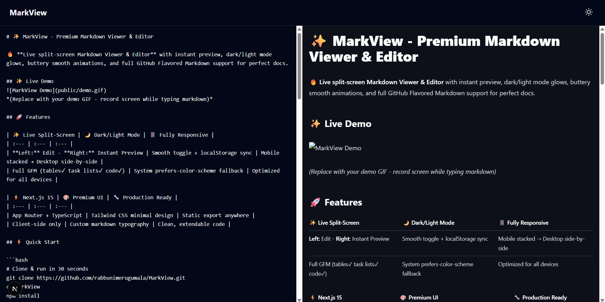

# ✨ MarkView - Premium Markdown Viewer & Editor

🔥 **Live split-screen Markdown Viewer & Editor** with instant preview, dark/light mode glows, buttery smooth animations, and full GitHub Flavored Markdown support for perfect docs.

## ✨ About MarkView
MarkView is a premium, real-time Markdown editor designed for developers and writers who value speed and aesthetics. It features a seamless split-screen interface that renders GitHub Flavored Markdown instantly as you type. Built with **Next.js 15** and **Tailwind CSS**, MarkView runs entirely on the client-side, ensuring lightning-fast performance and total privacy. With a polished dark mode, responsive design, and smooth animations, it provides a top-tier writing experience right in your browser.

## 🚀 Features

| ✨ Live Split-Screen | 🌙 Dark/Light Mode | 📱 Fully Responsive |
| :--- | :--- | :--- |
| **Left:** Edit - **Right:** Instant Preview | Smooth toggle + localStorage sync | Mobile stacked → Desktop side-by-side |
| Full GFM (tables✓ task lists✓ code✓) | System prefers-color-scheme fallback | Optimized for all devices |

| ⚡ Next.js 15 | 🎨 Premium UI | 🔧 Production Ready |
| :--- | :--- | :--- |
| App Router + TypeScript | Tailwind CSS minimal design | Static export anywhere |
| Client-side only | Custom markdown typography | Clean, extendable code |

## ⚡ Quick Start

```bash
# Clone & run in 30 seconds
git clone https://github.com/rabbunimerugumala/MarkView.git
cd MarkView
npm install
npm run dev
# Live preview → localhost:3000 🚀
```

## 🛠 Tech Stack
- **100% Client-side** - No backend required.
- **Next.js 15** (App Router)
- **Tailwind CSS**
- **TypeScript**
- **React Markdown**

## 📱 Screenshots



## 📁 Clean Structure

```text
markview/
├── app/
│   ├── layout.tsx         # Theme provider + globals
│   ├── page.tsx           # 2-column editor UI
│   └── globals.css        # Tailwind base
├── components/
│   ├── MarkdownEditor.tsx # Left textarea
│   ├── MarkdownPreview.tsx # Right preview  
│   └── ThemeToggle.tsx    # Mode switcher
├── lib/
│   └── theme.ts           # Theme storage
├── tailwind.config.ts     # Dark mode setup
└── package.json           # Minimal deps
```

## 🚀 Deploy Anywhere (1-click)

```bash
npm run build
npm run export  # → /out folder (static)
```

**Deploy to:**

[](https://vercel.com/new/clone?repository-url=https%3A%2F%2Fgithub.com%2Frabbunimerugumala%2FMarkView)
[](https://app.netlify.com/start/deploy?repository=https://github.com/rabbunimerugumala/MarkView)

## 🎨 Easy Customization

```tsx
// 1. Colors → tailwind.config.ts
theme: { extend: { colors: { primary: '#your-color' } } }

// 2. Markdown → MarkdownPreview.tsx
const customRenderers = {
  code: ({node, inline, className, children, ...props}) => (
    <code className="your-custom-styles">{children}</code>
  )
}

// 3. Layout → page.tsx Tailwind classes
<div className="flex flex-col md:flex-row gap-4 p-6">
```

## 🌙 Theme System
- Tailwind darkMode: 'class'
- Persists in localStorage
- Auto-detects system preference
- Smooth transitions

## 🛠 Commands

```bash
npm run dev     # localhost:3000
npm run build   # Production build
npm run start   # Production server
npm run lint    # ESLint check
npm run export  # Static export
```

## ❤️ Show Support
⭐️ Star this repo if MarkView saves you time!

## 📄 License
MIT License - Use freely in commercial projects.

<div align="center"> Made with ❤️ using Next.js 15 App Router + TypeScript <br> <i>Perfect for developers who love clean code</i> </div>